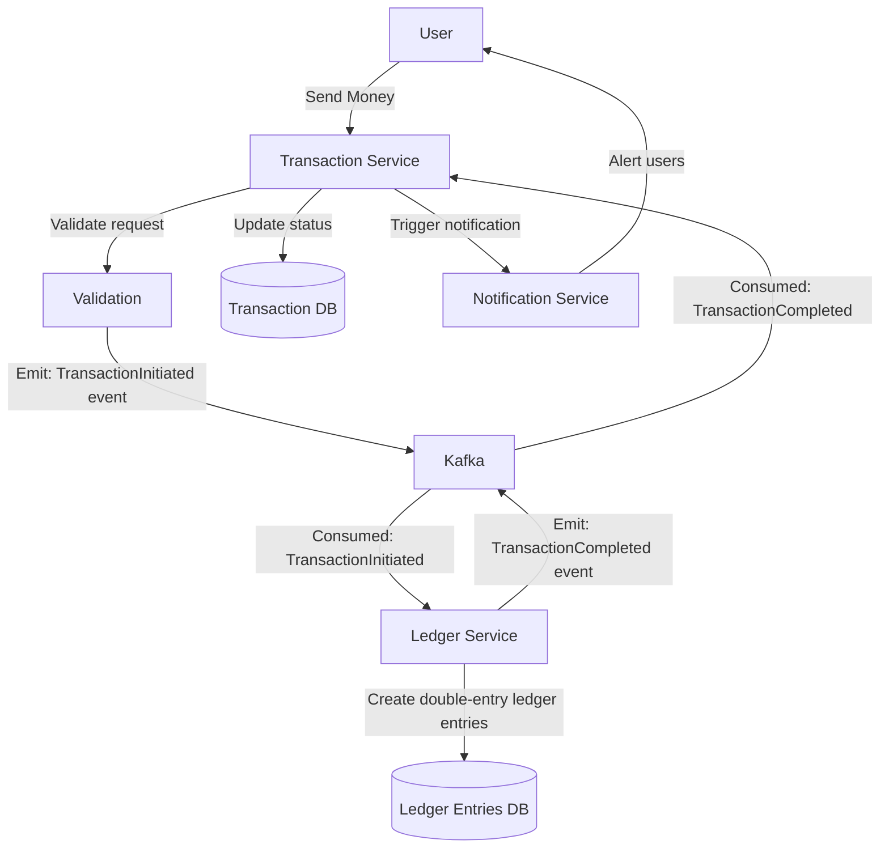

# Application Development

## Friday, September 26th 2025

Digital Wallet Project - Work Summary:

Backend (Go + Gin):

- Fixed Go module imports (digitalwallet/backend/database)
- Set up JWT authentication with session-based tokens
- Configured CORS for React frontend (localhost:5173)
- Implemented cookie-based auth (HttpOnly cookies)
- Added user login endpoint with proper error handling
- Fixed JWT type assertion bug (float64 vs int64)
- Updated to JWT v5 library

Project Structure:

- Created .gitignore for Go projects
- Organized code into packages (database, middlewares, config)
- Added User struct with ID field
- Implemented session storage system

Authentication Flow:

- Login generates session token (not JWT currently)
- Token stored in HttpOnly cookie for security
- Auth middleware validates requests
- CORS configured for credential-based requests

Frontend Integration:

- Configured React to send cookies with credentials: 'include'
- Discussed authentication checking patterns
- Explained React StrictMode double-execution behavior
- Covered race condition prevention in useEffect

Current Status: Basic authentication system working with cookie-based sessions
between React frontend and Go backend.

## Tuesday, October 14th 2025

### Ledger service

A microservice whose focus is to maintain the integrity of the applications's accounting system for my wallet. It implements double-entry bookeeping.

### Double-entry bookeeping

Every transaction that occurs in the system must create two entries:

- **credit**: money entering the account
- **debit**: money leaving the account

This ensures that the system is always balanced.

### Benefits

- Immutable entries

```SQL
  -- GOOD: Immutable ledger entries
  INSERT INTO ledger_entries (wallet_id, amount, type, transaction_id)
  VALUES
    ('alice_wallet', -50, 'DEBIT', 'txn_123'),
    ('bob_wallet', 50, 'CREDIT', 'txn_123');

  -- Balance is CALCULATED from entries
  SELECT SUM(amount) FROM ledger_entries WHERE wallet_id = 'alice_wallet';
```

- Keep a trail of every transaction on the system
- System is provably consistent

### How It Fits Your Architecture



# Set up JWT token with GoLang

https://www.youtube.com/watch?v=XFxm6NEWakQ&t=621s
https://github.com/golang-jwt/jwt

# Parsing the incoming body of a request as JSON

https://stackoverflow.com/questions/61919830/go-gin-get-request-body-json

# GoLang "if" pattern

The pattern on line 34 is a Go idiom for error handling with immediate assignment and checking.

Here's what's happening:

```go
if err := c.BindJSON(&user); err != nil {
return
}
```

Breaking it down:

1. := (short variable declaration): Creates and assigns the err variable in one step
2. c.BindJSON(&user): Attempts to parse the JSON request body into the user struct
3. err != nil: Checks if an error occurred
4. return: Exits the function early if there was an error

This pattern combines:

- Variable declaration
- Function call
- Error checking
- Early return

It's equivalent to writing:

```go
err := c.BindJSON(&user)
if err != nil {
return
}
```

Why this pattern is common in Go:

- Concise: Handles the common "call function, check error" pattern in one line
- Scoped: The err variable only exists within the if block
- Idiomatic: Very standard Go style for error handling

Note: Your current code just returns without sending an error response. You might want to add:

```go
if err := c.BindJSON(&user); err != nil {
c.JSON(http.StatusBadRequest, gin.H{"error": "Invalid JSON"})
return
}
```

# Read environment variables

```go
import (
    "os"
    "fmt"
)

var ENV_VARIABLE = os.GetEnv("my-env-variable")
fmt.Println(ENV_VARIABLE)
```

# Set environment variable upon starting server on the CLI

`❯ JWT_SECRET=my-secret-key go run app.go`
